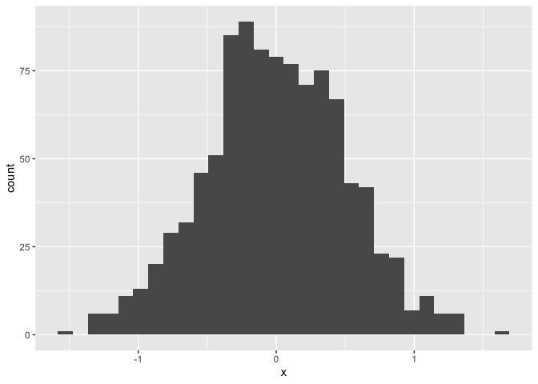
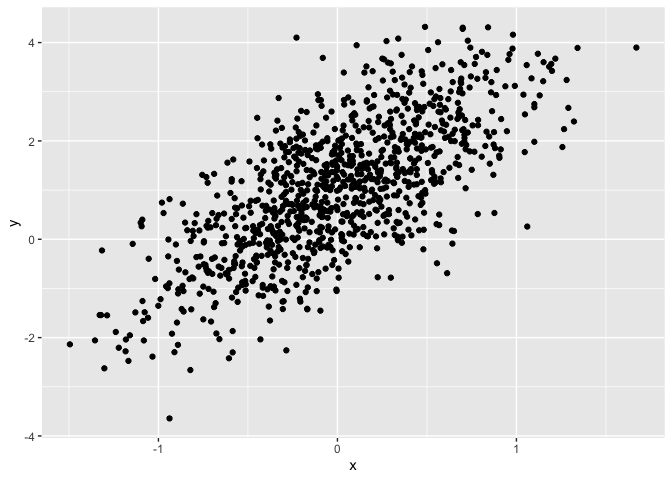
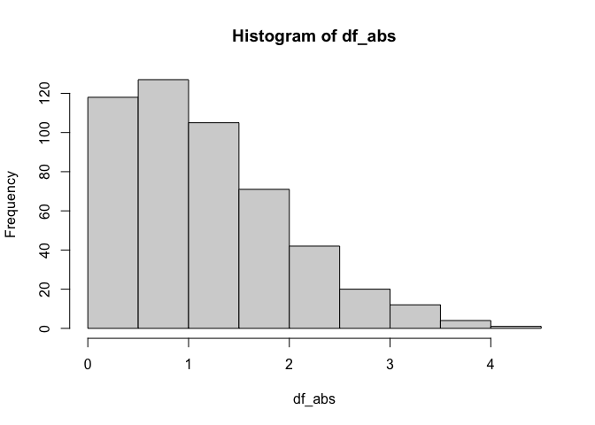
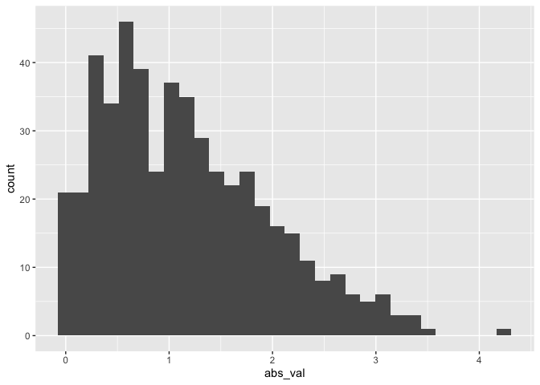

Simple document
================
Shihui Zhu
2021-09-16

I’m an R Markdown document!

``` r
library(tidyverse)
```

# Section 1

Here’s a **code chunk** that samples from a *normal distribution*:

``` r
samp = rnorm(100)
length(samp)
```

    ## [1] 100

# Section 2

I can take the mean of the sample, too! The mean is -0.072171.

# Section 3

Let’s write a new code chunk

This code chunk imports the ‘tidyverse,’ create a dataframe

``` r
# echo, eval, collapse, message
plot_df <-
  tibble(
    x = rnorm(1000, sd = .5),
    y = 1 + 2 * x + rnorm(1000)
  )

ggplot(plot_df, aes(x = x)) + geom_histogram()
```

<!-- -->

``` r
ggplot(plot_df, aes(x = x, y = y)) + geom_point()
```

<!-- -->

# Practices

## My Solution

``` r
# eval = FALSE
# echo = FALSE
df <- rnorm(500, 1)
log_vec <- df > 0
df_abs <- abs(df)
hist(df_abs)
```

<!-- -->

``` r
median(df_abs)
```

    ## [1] 1.023688

``` r
## The median is 1
```

## Learning Assessment Solution

``` r
# Solution
set.seed(123)
learning_df <- 
  tibble(
    sample = rnorm(500, mean = 1),
    gr_than_0 = sample > 0,
    abs_val = abs(sample)
  )
ggplot(learning_df, aes(x = abs_val)) + geom_histogram(bins = 30)
```

<!-- --> \*
here is a list \* \#\#\# sub-sub section

# Render Package

rmarkdown::render(input = ‘name.Rmd’, output\_format = ‘name.html’,
output\_file = ‘result/output.html’)
